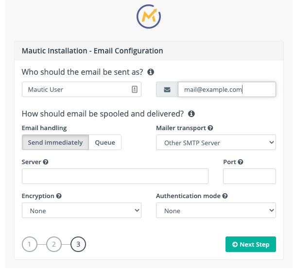

# Injecting Using SMTP

KumoMTA will listen for message injection in any
[listener](../../reference/kumo/start_esmtp_listener.md)
[defined](../..//reference/kumo/start_http_listener.md) in
configuration. You have complete control over the IPs and Ports available for
message injection.

The ESMTP Listener will accept any properly formatted SMTP connection request
allowed by its configuration.  For instance, based on this:

```lua
kumo.start_esmtp_listener {
  listen = '0.0.0.0:25',
  hostname = 'mail.example.com',
  relay_hosts = { '127.0.0.1', '10.5.1.0/24' },
}
```

KumoMTA will accept any SMTP injection from the local host as well as any hosts
in the 10.5.1.0/24 CIDR block on port 25.  The most basic form of "injection"
is to test from localhost using nc or telnet.

```
ehlo moto
mail from:youremail@address.com
rcpt to:youremail@address.com
DATA
from:youremail@address.com
to:youremail@address.com
subject: My First Email

Hey, this is my first email!
.

```

If that returns a `250 OK`, then any more complex injection should work as well.

In most campaign systems that connect with third-party MTA's, you will need to
enter the configuration settings, and find something like "SMTP" or "OutBound
Email" and set the SMTP Port, Hostname or IP ddress and If you have configured
[SMTP_Auth](../..//reference/events/smtp_server_auth_plain.md),
your injection username and password as well.

Below is a sample of the configuration page for
[Mautic](https://docs.mautic.org/en/setup/how-to-install-mautic/install-mautic-from-package)
marketing automation.



